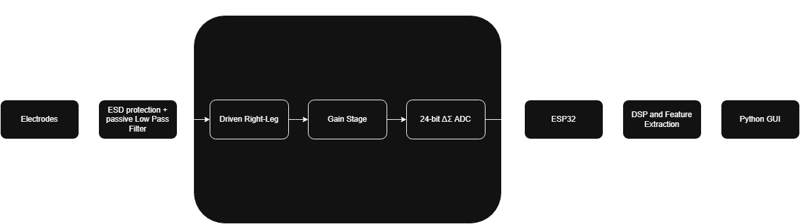

# EMG Analog Front-End PCB

High-precision 4-layer mixed-signal PCB for electromyography (EMG) signal acquisition.

## Overview
Our Senior Design project combines B-mode Ultrasound Imaging with EMG to assess post-ACL reconstruction rehabilitation. By analyzing muscle thickness and activation, we can give clinicians another metric to use to quantify and motivate progress. This repo will primarily focus on the EMG AFE functional block.

## System Architecture

## Desired Specifications
- **CMRR**: 100 dB
- **Input Noise**: <5 µVrms
- **Channels**: 1 differential
- **Bandwidth**: 0.5 - 500 Hz
- **Board**: 4-layer, mixed-signal design

## Tools Used
- KiCad 
- LTspice
- Arduino IDE
- Oscilloscope
- Function Generator

## Validation
Benchtop testing with function generator and oscilloscope (IN PROGRESS)

---

**Project Date**: August 2025 - Present  
**Team**: Senior Design Team (4 members)  
