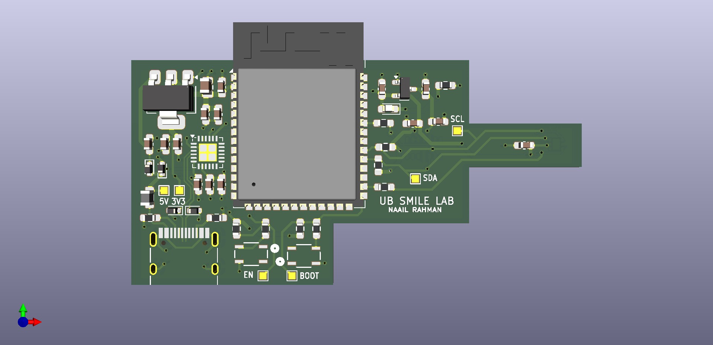
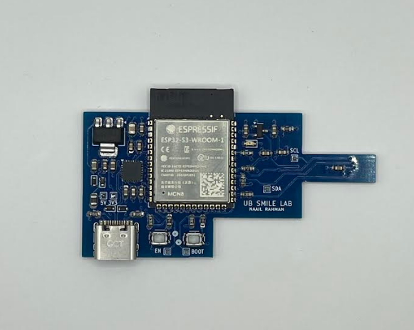

# Neonatal Wearable Sensor PCB

2-layer PCB integrating temperature and SpO2 sensors for transcranial neonatal imaging research.

## Overview
Designed and validated PCB for neonatal wearable device at SMILE Lab, integrating physiological sensors for research applications.

## Specifications
- **Sensors**: TMP117 (temperature), MAX30102 (SpO2)
- **Timing Accuracy**: <10ms
- **Mechanical Tolerance**: ±0.2mm
- **Communication**: I2C bus
- **Board**: 2-layer PCB

## Key Features
- Accurate temperature and SpO2 readings
- Synchronized data acquisition across sensors
- Custom 3D-printed housings for sensor alignment
- Repeatable measurements for research applications

## Technical Work
- PCB design and validation in KiCad
- Debugged signal integrity and power issues using oscilloscope
- Embedded firmware development in C++
- SolidWorks design for precision mechanical housing

## Research Application
Part of transcranial neonatal imaging research at SMILE Lab, University at Buffalo.

## Tools Used
- KiCad for PCB design
- C++ for embedded firmware
- SolidWorks for mechanical design
- Oscilloscope for debugging

## Rigid PCB Prototype

Prior to diving straight into a flex PCB, we made an inital rigid PCB prototype as a proof of concept, as seen in the above image. This helped us realize we could reduce the size by going from an ESP32 to a STM32 or nrf52480.
---

**Project Date**: February 2025 - Present  
**Lab**: SMILE Lab, University at Buffalo  
**Status**: Active research
