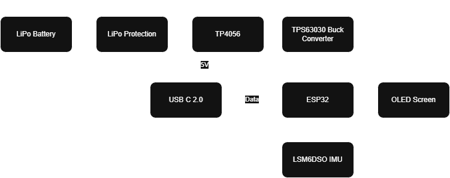

# Velocity-Based Training Device

Real-time barbell velocity measurement system using IMU sensor fusion.

## Overview
Weight-lifting device to measure velocity loss on free-weight, pulley, and machine exercises, using ESP32 and LSM6DSO IMU.

## System Architecture

## Specifications
- **Accuracy**: <8% error in velocity loss measurements
- **Sensor**: LSM6DSO IMU (accelerometer + gyroscope)
- **Microcontroller**: ESP32
- **Analysis**: Python with FFT

## Key Features
- Real-time velocity calculation
- FFT analysis to characterize frequency content
- High-pass filter (0.2 Hz cutoff) to minimize drift
- Custom 3D-printed enclosure

## Technical Details
- Analyzed acceleration data using Fast Fourier Transform
- Determined optimal filter cutoff to preserve motion signals
- Camera validation for ground truth measurements

## Tools Used
- ESP32 microcontroller
- LSM6DSO IMU
- Python (NumPy, Matplotlib, SciPy)
- SolidWorks for enclosure design
- 3D printing

